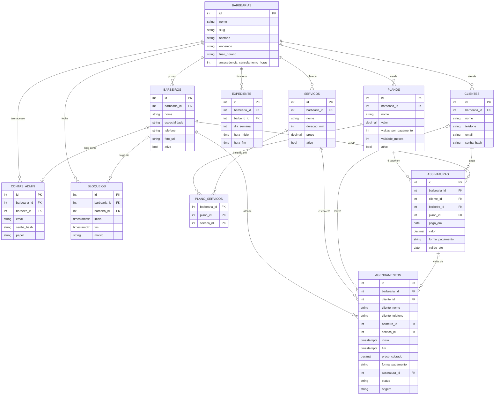

# Modelagem do banco de dados — ZT Barber

Banco **PostgreSQL**, modelado como **multi-tenant**: uma tabela `barbearias`
e uma coluna `barbearia_id` em todas as outras. Hoje só existe a ZT Barber
(`id = 1`), mas o mesmo banco pode atender outras barbearias no futuro sem
redesenho, com cada uma enxergando apenas os próprios dados.

Arquivos:

- `database/schema.sql` — cria as tabelas
- `database/seed.sql` — dados iniciais da ZT Barber (barbeiros, serviços, expediente, feriados)

Regras de negócio confirmadas com o cliente em 28/09/2026.

---

## Diagrama



---

## Tabelas

### `barbearias`
O cliente do sistema. Todas as outras tabelas pertencem a uma barbearia.

| Campo | Tipo | Observação |
|---|---|---|
| id | serial PK | |
| nome | varchar(150) | "ZT Barber" |
| slug | varchar(100) unique | `zt-barber`, para URL caso o sistema atenda várias barbearias |
| telefone, endereco | varchar | |
| fuso_horario | varchar(50) | `America/Sao_Paulo`; usado nos relatórios por mês |
| antecedencia_cancelamento_horas | int | cliente pode cancelar até 3 horas antes |

### `barbeiros`
| Campo | Tipo | Observação |
|---|---|---|
| id | serial PK | |
| barbearia_id | FK | |
| nome, especialidade | varchar | Train e Zefe |
| telefone | varchar | recebe aviso de novo agendamento pelo WhatsApp |
| foto_url | varchar | nulo até termos as fotos |
| ativo | boolean | desativar sem apagar o histórico |

### `servicos`
| Campo | Tipo | Observação |
|---|---|---|
| id | serial PK | |
| barbearia_id | FK | |
| nome | varchar | |
| duracao_min | int | usado para calcular o fim do agendamento |
| preco | numeric(10,2) | preço de tabela |
| ativo | boolean | |

Não existe preço por barbeiro: os dois cobram o mesmo. O desconto "de amigo"
é aplicado no próprio agendamento (`preco_cobrado`).

### `clientes`
Quem agenda pelo site. **Não há conta com senha**: o cliente agenda só com nome
e WhatsApp, e é identificado pelo telefone. E-mail e senha ficam opcionais para
uso futuro.

| Campo | Tipo | Observação |
|---|---|---|
| id | serial PK | |
| barbearia_id | FK | |
| nome | varchar | |
| telefone | varchar | único por barbearia |
| email | varchar, nulo | único por barbearia quando preenchido |
| senha_hash | varchar, nulo | não usado na versão 1 |

### `contas_admin`
Quem entra no painel. É separado de `clientes` porque tem outra permissão.

| Campo | Tipo | Observação |
|---|---|---|
| id | serial PK | |
| barbearia_id | FK | |
| barbeiro_id | FK, nulo | liga a conta ao barbeiro (Train e Zefe são donos **e** barbeiros) |
| nome, email | varchar | email único por barbearia |
| senha_hash | varchar | sempre bcrypt; criada pela API, nunca à mão no SQL |
| papel | `dono` \| `barbeiro` | dono vê o faturamento de todos |

### `expediente`
Turnos de funcionamento. Dois turnos no mesmo dia = pausa de almoço entre eles.

| Campo | Tipo | Observação |
|---|---|---|
| id | serial PK | |
| barbearia_id | FK | |
| barbeiro_id | FK, nulo | nulo = vale para todos (caso da ZT Barber) |
| dia_semana | smallint | 0 = domingo … 6 = sábado |
| hora_inicio, hora_fim | time | |

| Dia | Turnos |
|---|---|
| Segunda | 13:30–20:00 |
| Terça a sexta | 09:00–12:00 e 13:30–20:00 |
| Sábado | 09:00–12:00 e 13:30–16:00 |
| Domingo | sem linhas = fechado |

### `bloqueios`
Folga, férias, feriado ou compromisso.

| Campo | Tipo | Observação |
|---|---|---|
| id | serial PK | |
| barbearia_id | FK | |
| barbeiro_id | FK, nulo | nulo = barbearia inteira (feriado) |
| inicio, fim | timestamptz | |
| motivo | varchar | |

A barbearia fecha em **todos** os feriados. O `seed.sql` cadastra os nacionais
e o municipal de Rio Negro (6 de agosto) até o fim de 2027. A lista precisa ser
atualizada uma vez por ano.

### `agendamentos`
| Campo | Tipo | Observação |
|---|---|---|
| id | serial PK | |
| barbearia_id | FK | |
| cliente_id | FK, nulo | nulo em encaixe de quem não tem cadastro |
| cliente_nome, cliente_telefone | varchar | copiados na hora; funcionam mesmo sem cadastro |
| barbeiro_id, servico_id | FK | |
| inicio, fim | timestamptz | `fim = inicio + duracao_min` do serviço |
| preco_cobrado | numeric(10,2) | copia o preço do serviço ao agendar; o barbeiro pode alterar (desconto) ao concluir |
| forma_pagamento | `pix` \| `dinheiro` \| `debito` \| `credito` \| `plano` | preenchida ao concluir; `plano` = visita do plano mensal, com `preco_cobrado` 0 |
| assinatura_id | FK, nulo | de qual pagamento de plano saiu a visita; volta a nulo ao desfazer ou cancelar |
| status | `confirmado` \| `concluido` \| `cancelado` \| `nao_compareceu` | |
| origem | `site` \| `encaixe` \| `painel` | |
| observacao | varchar | |


### `planos`
O que a barbearia vende: Plano Corte (R$ 110) e Plano Completo (R$ 160).

| Campo | Tipo | Observação |
|---|---|---|
| id | serial PK | |
| barbearia_id | FK | |
| nome | varchar(100) | único por barbearia |
| valor | numeric(10,2) | |
| visitas_por_pagamento | int | 4 |
| validade_meses | int | 2: cada pagamento vale por 2 meses |
| ativo | boolean | |

### `plano_servicos`
Em quais serviços cada plano pode ser usado. É o que bloqueia, por exemplo, barba no Plano Corte.

| Campo | Tipo | Observação |
|---|---|---|
| barbearia_id | FK | |
| plano_id, servico_id | PK composta, FK | |

### `assinaturas`
**Um registro por pagamento.** Cada um libera 4 visitas. Pagou em outubro e novembro = 2 registros = até 8 visitas.

| Campo | Tipo | Observação |
|---|---|---|
| id | serial PK | |
| barbearia_id | FK | |
| cliente_id | FK | o cliente é criado na venda se ainda não existir |
| barbeiro_id | FK | quem vendeu; o plano só vale com ele |
| plano_id | FK | |
| pago_em | date | só do dia 1 ao 5 do mês (`CHECK`) |
| valor | numeric(10,2) | copiado do plano na hora da venda |
| forma_pagamento | `pix` \| `dinheiro` \| `debito` \| `credito` | |
| valido_ate | date | `pago_em` + 2 meses; o último dia ainda vale |

Visitas restantes de um pagamento = `visitas_por_pagamento` − agendamentos **concluídos** com aquele `assinatura_id`. Não é guardado, é calculado.

---

## Regras garantidas pelo próprio banco

**1. Sem choque de horário.** A constraint `agendamentos_sem_sobreposicao`
impede que o mesmo barbeiro tenha dois agendamentos com intervalos
sobrepostos, considerando a duração real de cada um:

```sql
EXCLUDE USING gist (barbeiro_id WITH =, tstzrange(inicio, fim) WITH &&)
WHERE (status <> 'cancelado')
```

Um combo das 09:00 às 10:00 bloqueia um corte às 09:30 do mesmo barbeiro,
mesmo que dois clientes cliquem ao mesmo tempo. Agendamento cancelado libera
o horário. Depende da extensão `btree_gist`, que o `schema.sql` já ativa.

**2. Isolamento entre barbearias.** As chaves estrangeiras compostas
`(barbearia_id, barbeiro_id)`, `(barbearia_id, servico_id)` e
`(barbearia_id, cliente_id)` impedem, por exemplo, um agendamento da
barbearia 2 com um barbeiro da barbearia 1.

**3. Valores válidos.** `CHECK` em status, forma de pagamento, papel,
`fim > inicio`, preço e duração não negativos.

**4. Plano só do dia 1 ao 5.** O `CHECK (EXTRACT(DAY FROM pago_em) BETWEEN 1 AND 5)`
da tabela `assinaturas` recusa venda fora da janela, mesmo se a API errar.

---

## Consultas principais

**Faturamento do mês por barbeiro** (painel dos donos):

```sql
SELECT b.nome AS barbeiro,
       COUNT(*)             AS atendimentos,
       SUM(a.preco_cobrado) AS total
FROM agendamentos a
JOIN barbeiros b ON b.id = a.barbeiro_id
WHERE a.barbearia_id = $1
  AND a.status = 'concluido'
  AND a.inicio >= $2   -- início do mês
  AND a.inicio <  $3   -- início do mês seguinte
GROUP BY b.nome
ORDER BY b.nome;
```

**Agenda do dia de um barbeiro:**

```sql
SELECT a.inicio, a.fim, a.cliente_nome, s.nome AS servico, a.status
FROM agendamentos a
JOIN servicos s ON s.id = a.servico_id
WHERE a.barbeiro_id = $1
  AND a.status <> 'cancelado'
  AND a.inicio >= $2 AND a.inicio < $3
ORDER BY a.inicio;
```

**Horários livres:** calculados na API. Ela gera os horários de 30 em 30
minutos dentro de cada turno do `expediente` e descarta os que se sobrepõem a
agendamentos ou `bloqueios`. É a mesma lógica que hoje roda no `script.js`.

---

## Como rodar localmente

```bash
psql -U postgres -c "CREATE DATABASE zt_barber;"
psql -U postgres -d zt_barber -f database/schema.sql
psql -U postgres -d zt_barber -f database/seed.sql
```

---

## Fica para depois

| Tabela | Quando |
|---|---|
| `planos`, `assinaturas` | planos mensais, versão 2: R$110 = 4 cortes + sobrancelha de brinde; R$160 = 4 cortes + 4 barbas. Não usados acumulam, com limite de 4 |
| `mensagens_whatsapp` | log de confirmações/lembretes enviados, para não mandar em duplicidade |
| `avaliacoes` | depoimentos reais no site |

Não entram: `produtos` (não vendem) e `pagamentos` online (não cobram sinal).
